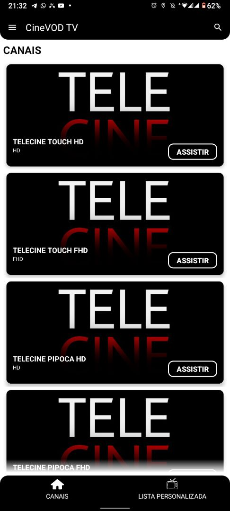
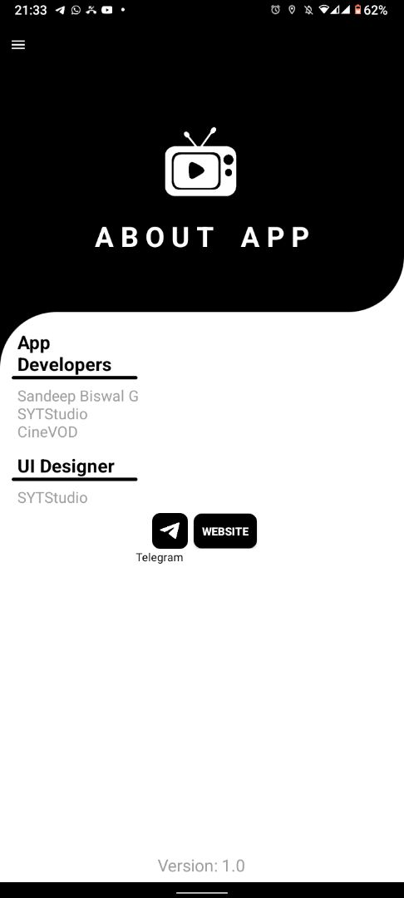
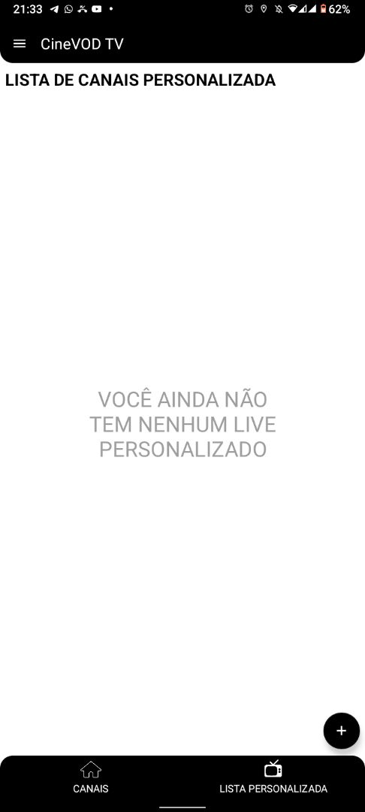

# Projeto CineVOD

Este é um projeto de aplicativo de streaming de filmes, totalmente modificado e adaptado para o CineVOD. O projeto foi clonado do aplicativo SGD Live TV, com créditos para Sandeep Biswal G e SYTStudio.

## Descrição

O CineVOD é um aplicativo de vídeo sob demanda (VOD) que oferece uma ampla variedade de filmes para os usuários assistirem a qualquer momento. Ele foi desenvolvido com base no SGD Live TV, mas foi totalmente personalizado e adaptado para fornecer uma experiência única aos usuários.

## Recursos

- Interface intuitiva para navegar pelos filmes.
- Biblioteca de filmes organizada por gênero, popularidade e lançamentos.
- Opções de pesquisa para encontrar filmes específicos.
- Reprodução de filmes em alta qualidade.
- Opções de compartilhamento e avaliação de filmes.

## Prints de Tela

Aqui estão alguns prints de tela do aplicativo:

1. Tela inicial:
   

2. Tela de Sobre:
   

3. Lista Personalizada:
   

## Como usar

1. Faça o download do aplicativo.
2. Instale o aplicativo em seu dispositivo Android.
3. Explore a biblioteca de filmes, assista aos trailers e escolha o filme que deseja assistir.
4. Desfrute de uma experiência cinematográfica de alta qualidade diretamente no seu dispositivo.

## Contribuição

Contribuições são bem-vindas! Se você tem ideias para novos recursos, melhorias na interface ou deseja relatar problemas, sinta-se à vontade para contribuir para o projeto.

## Créditos

Este projeto foi clonado do aplicativo SGD Live TV, com modificações e personalizações realizadas por Sandeep Biswal G e SYTStudio para criar o CineVOD.

---

**Autor:** Sandeep Biswal G, SYTStudio  
**Versão:** 1.0  
**Última atualização:** Maio de 2024
